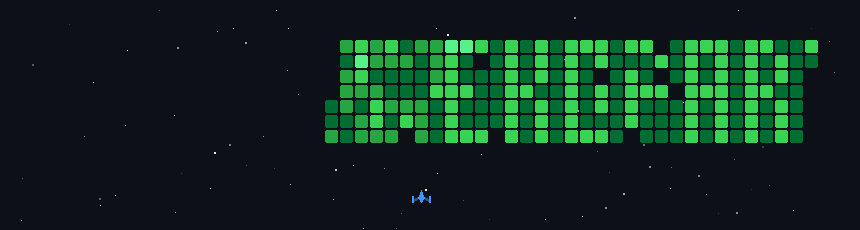

# 📟 Maximiliano Rodriguez | Electronics, Cybersecurity & 3D Design

### 📌 About Me

 **I am a passionate developer focused on** `Hardware Description Languages` , `Embedded Systems`, `Hardware Hacking`, `Cybersecurity`, **and** `3D Design`. **Currently, I am exploring the performance limits of FPGAs, functional 3D modeling, and key fundamentals of information security.**
 
---

 ### 👥 Communities I lead in San Luis, Argentina

 

   

 

   

---

### 💻 Tech Stack
Languages
 

Electronics Software 

3D Software

Certifications & Badges

  

---

 

I fight for the users

### 📬 Stay in touch

  
   
   

